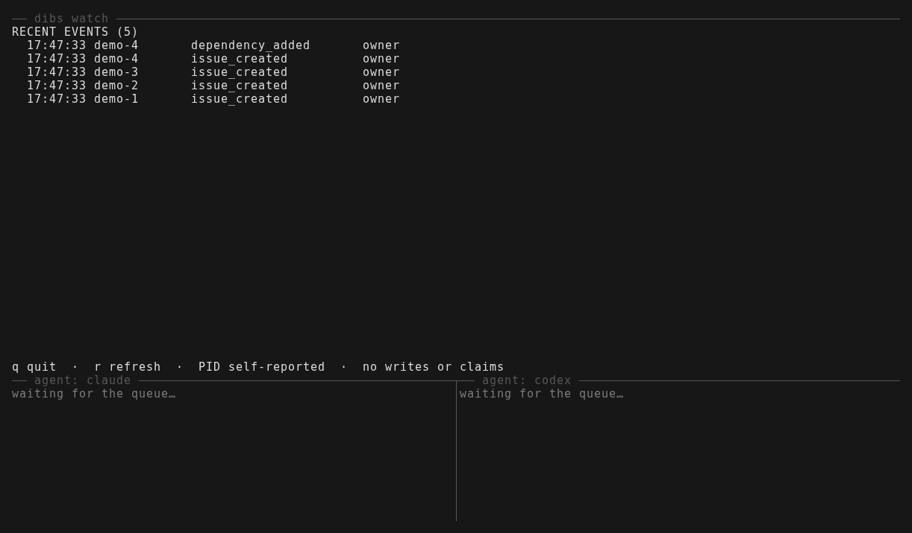

# dibs

When two local AI agents pick the same task, both can spend time on it before
either notices. `dibs` gives them a shared ready queue and an atomic claim:
one gets the lease, while the other sees that the work is taken.



Two simulated agents (shell scripts named claude and codex, not real model
sessions) drain one queue with `dibs issue run --require-complete` while
`dibs watch` shows the board. Both try `demo-1` at the same moment and exactly
one gets the lease. The first attempt at `demo-3` fails, so its lease is handed
off and the task returns to the queue. The losing agent prints dibs's own
`lease_held` message. It was recorded with the published `v0.1.0-rc.3`
binaries, a temporary daemon, and temporary state; re-record it with
[`contrib/demo/record.sh`](contrib/demo/record.sh).

**Your AI agents call dibs on work. Exactly one wins.**

## Start in four commands

From a Git repository not yet registered with dibs on Linux or macOS, install
the published preview, initialize dibs, create a task, and claim it:

```sh
curl -fsSL https://github.com/abevz/dibs/releases/download/v0.1.0-rc.3/install.sh | sh /dev/stdin
~/.local/bin/dibs init
~/.local/bin/dibs issue create --project myapp --scope-kind project --title "First task"
~/.local/bin/dibs issue claim myapp-1 --holder "$USER"
```

This example assumes the inferred project key is `myapp` and its task counter
starts at 1. Use the key printed by `dibs init` and the short ID printed by
`issue create` when they differ from `myapp` and `myapp-1`. The installer
verifies the archive checksum and needs no sudo. `init` starts the local daemon
when needed. A successful claim prints a lease token; keep it private and use
the [agent workflow](docs/agent-protocol-v1.md) when automating work. The
[release smoke test](docs/specs/016-adoption/review.md) records the four-command
path on Linux; the installer was also checked natively on the advertised Linux
and macOS architectures.

If you prefer to inspect the script before running it:

```sh
curl -fsSL -o install.sh https://github.com/abevz/dibs/releases/download/v0.1.0-rc.3/install.sh
less install.sh
sh install.sh
```

See [installation](docs/install.md) for PATH setup, Homebrew, version selection,
repeat installation, and removal. The preview is a prerelease, so GitHub's
`latest` release URL does not select it.

## How agents use it

```text
create task -> ready queue -> atomic claim -> heartbeat -> handoff or close
```

`dibs` tracks issues, dependencies, leases, notes, and events across projects,
repositories, and Git worktrees. An unexpired lease keeps a task out of the
ready queue. If the worker disappears, the lease expires so the task can be
picked up again. `dibs issue run` wraps a child command with claim, heartbeat,
and close or handoff behavior, without putting the lease token on the command
line.

The daemon is the single writer to a local SQLite database. The CLI and MCP
wrapper use its HTTP API over a Unix socket. Specs and source code stay in Git;
dibs stores the live execution state. It runs on one machine and does not sync
leases across machines.

The preview provides `dibs watch --project <key>` for a live,
read-only view of ready work, active lease holders and remaining time,
blockers, and recent events. Use `--once` for a text snapshot or `--json` for
a machine-readable one. It does not claim tasks. Active `issue run` leases show
their self-reported supervisor PID and host. New manual `issue claim` leases
show a caller ancestor PID and host when available; that process can exit while
the lease remains active. These values are diagnostics, not lease ownership.

Claude Code and Codex can show ready work when a session starts. Install the
project hook with `dibs hooks install --agent claude` or
`dibs hooks install --agent codex`, then choose one task for a one-shot
`dibs issue run <issue-id> --require-complete -- <agent command>`. The agent
calls `dibs hooks complete` after meeting the task's acceptance criteria.
See the [agent integration guide](contrib/hooks/README.md).

GitHub import and result publication in a source build require GitHub CLI
2.48.0 or newer and `gh auth login`. `dibs doctor` checks the installed
version, authentication, and API access. `dibs issue publish` posts the
closing note and branch publicly to the source issue.

## Current scope

The published preview supports local issue creation, dependencies, ready
queries, claims, handoffs, audit events, live watch, and one-shot Claude Code
and Codex hooks. GitHub issue import and result publication, plus stored
attachments, remain planned work. Jira is only a possible future adapter; no
Jira target or plugin format is committed. See the
[delivery plan](docs/specs/016-adoption/implementation-plan.md) for the order
and acceptance criteria.

## Documentation and development

- [Installation and first use](docs/install.md)
- [Agent protocol](docs/agent-protocol-v1.md)
- [Operations and service setup](docs/operations.md)
- [Architecture](docs/architecture-v1.md)
- [SDD workflow](docs/sdd-workflow-v1.md) and [spec packets](docs/specs/)
- [API](docs/api-v1.md) and [MCP wrapper](docs/mcp-server-v1.md)
- [Roadmap](docs/roadmap.md)

For a source checkout, use the Go version in [go.mod](go.mod), then run
`make preflight`, `make build`, and `make test`. Release packaging and manual
service switching are documented in [installation](docs/install.md) and
[operations](docs/operations.md).

dibs is licensed under [Apache License 2.0](LICENSE).
